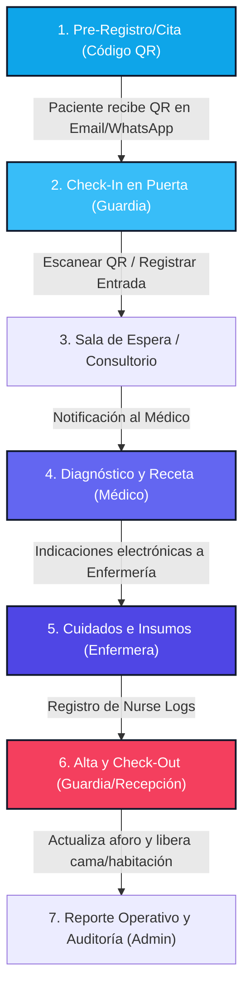

# 🏥 Aozora Care-Flow: Sales Kit & Guía de Producto
### *La plataforma inteligente de control de accesos, trazabilidad y gestión de aforo clínico*

Este documento es una guía comercial y de producto completa, diseñada para equiparte con argumentos sólidos, flujos técnicos detallados y un guion de demostración efectivo al presentar **Aozora Care-Flow** a directores médicos, jefes de operaciones y tomadores de decisiones en el sector de salud.

---

## 💖 Nuestra Inspiración: El Origen de Aozora
*Aozora significa **"Cielo Azul"** en japonés, representando esperanza, claridad y un mañana brillante y despejado.*

Este proyecto nace de una experiencia personal profunda: un momento de extrema vulnerabilidad cuando el hijo de nuestro fundador enfrentó complicaciones críticas al nacer en un hospital debido a fallas de comunicación y la falta de trazabilidad clínica en tiempo real. 

De por sí, la estancia en un hospital es un momento sumamente difícil de incertidumbre y dolor para cualquier familia; añadir errores administrativos o vacíos en el seguimiento clínico agrava esa carga de forma innecesaria.

**Aozora Care-Flow** fue concebido bajo una promesa solemne: transformar la tecnología de gestión hospitalaria para evitar que otras familias tengan que atravesar incidentes previsibles debido a la falta de coordinación. Es un ecosistema diseñado con profundo respeto y rigor técnico, con el único fin de salvaguardar la seguridad operativa del paciente, facilitando una estancia hospitalaria transparente, segura y libre de errores humanos prevenibles.

---

## 🎯 1. Resumen Ejecutivo
**Aozora Care-Flow** no es solo una libreta digital de firmas; es un **ecosistema de seguridad y trazabilidad operativa en tiempo real** para hospitales y clínicas modernas. 

El sistema digitaliza, agiliza y asegura el tránsito de pacientes, familiares, visitantes y proveedores desde el primer punto de contacto hasta su salida física del recinto. Al integrar tecnología de pases QR automáticos, flujos clínicos simplificados y telemetría de aforo hospitalario, la plataforma reduce la fricción en la entrada, previene brechas de seguridad y proporciona datos operativos valiosos para la administración.

---

## 🛑 2. Problemáticas del Sector vs Solución Aozora Care-Flow

| Desafío en Hospitales Tradicionales | Solución Inteligente de Aozora Care-Flow | Impacto Operativo |
| :--- | :--- | :--- |
| **Puntos de acceso saturados:** Recepción lenta con registros manuales en libretas físicas o Excel. | **Check-In en 15 segundos:** Autoservicio rápido en quiosco digital o escaneo inmediato de pase QR pre-agendado. | Reduce colas en hora pico en un 70%. |
| **Falta de control de aforo por zonas:** Desconocimiento de cuántas personas hay en urgencias, pisos de hospitalización o consultorios. | **Monitoreo de aforo en tiempo real:** Control visual del estatus de ocupación de salas y habitaciones. | Garantiza cumplimiento de normas de protección civil y bioseguridad. |
| **Falta de trazabilidad clínica:** Enfermeras y médicos duplican registros en papel para saber quién atendió a un paciente de corta estancia. | **Ecosistema Integrado Guardia-Médico-Enfermera:** El registro de entrada genera una ficha activa donde el médico prescribe y la enfermera registra insumos. | Elimina el papeleo en áreas de observación y triaje de urgencias. |
| **Brechas de seguridad física:** Personas no autorizadas deambulando en áreas críticas (neonatología, UCI, quirófanos). | **Validación estricta de destino:** Pases asociados a habitaciones específicas que expiran al hacer Check-Out. | Previene accesos no autorizados a zonas restringidas de alta vulnerabilidad. |

---

## 💻 3. Los 4 Pilares de la Aplicación (Estructura de Roles)

Aozora Care-Flow se adapta al flujo natural de trabajo hospitalario mediante cuatro portales especializados:

### 🛡️ A. Terminal del Guardia / Recepción (Control de Accesos)
* **¿Qué hace?**: Es la primera línea de defensa. Permite realizar Check-In rápido de visitantes de entrada general, validar y admitir pases pre-agendados mediante un escáner de códigos QR y realizar la salida (Check-Out) del sistema con un solo clic.
* **Funciones Clave**:
  - Escáner QR de alta velocidad integrado en navegador.
  - Buscador predictivo e inteligente de personas activas ("In House") por nombre o destino.
  - Alertas visuales sobre el estado de aforo en salas.

### 🩺 B. Portal del Médico Tratante (Trazabilidad y Atención)
* **¿Qué hace?**: Permite a los médicos de consultorios o urgencias ver en tiempo real a los pacientes registrados que se dirigen a su consulta, evitando gritar nombres en salas de espera.
* **Funciones Clave**:
  - Cola de atención dinámica y automatizada según el Check-In en puerta.
  - Registro simplificado de diagnóstico clínico (dolencias, síntomas).
  - Generador de recetas electrónicas (medicamentos y dosis) y recomendaciones de seguimiento.

### 💊 C. Portal de Enfermería (Seguimiento de Cuidados)
* **¿Qué hace?**: Centraliza la bitácora de administración de medicamentos, tratamientos aplicados e indicaciones clínicas durante la permanencia del paciente en observación, urgencias o habitaciones.
* **Funciones Clave**:
  - Creación de Nurse Logs (bitácoras de enfermería) directamente asociados a la visita activa.
  - Visibilidad total del historial de indicaciones dejadas por el médico tratante.
  - Registro de enfermera responsable, fecha, tratamientos y medicamentos suministrados.

### 📊 D. Panel de Administración y Managers (Métricas y Control)
* **¿Qué hace?**: Proporciona telemetría hospitalaria completa para directores médicos y gerentes administrativos. Permite configurar la infraestructura del hospital y auditar accesos.
* **Funciones Clave**:
  - Monitoreo en tiempo real de habitaciones y camas (Disponible, Ocupada, Mantenimiento).
  - Alta y gestión de médicos, consultorios y especialidades.
  - Reportes de tiempos de estancia promedio y horas pico de acceso.
  - Registro histórico completo de visitas para auditorías de seguridad.

---

## 🔄 4. Flujo de Vida de una Visita (Trazabilidad 360°)
Para entender el poder del sistema, este es el viaje digitalizado de un paciente en urgencias u observación:

---

## 🚀 5. Guion de Demostración Comercial (Paso a Paso)
*Usa este guion al hacer una presentación en vivo o compartir la pantalla con un cliente:*

### 🎬 Preparación:
1. Abre la página de inicio de **Aozora Care-Flow**.
2. Explica que el portal de inicio es público y sirve como quiosco de autoservicio o terminal de recepción.

### 🚶 Paso 1: El Registro y el QR
* **Acción**: En la pestaña **Check-In**, selecciona el tipo **Paciente** o **Visitante**. Ingresa un correo electrónico simulado (ej: `cliente.potencial@salud.com`) y un nombre. Haz clic en un consultorio o destino.
* **Argumento**: *"Al presionar registrar, el sistema calcula de inmediato la asignación de su especialista y, si el hospital lo tiene activado, genera un código QR exclusivo que el visitante puede guardar en su celular. Esto elimina los pases de plástico insalubres."*

### 👮 Paso 2: El Escaneo en Puerta
* **Acción**: Abre el modal **Escanear Cita QR** en el menú superior. Explica cómo la cámara o un escáner físico valida instantáneamente el pase.
* **Argumento**: *"Cuando el paciente llega a la puerta, el guardia escanea el QR en un segundo. El sistema valida el pase contra la base de datos de citas del día y lo marca como 'In House', alertando al doctor en su consultorio."*

### 🩺 Paso 3: La Consulta del Médico
* **Acción**: Haz login con el rol del médico en `/login` (ej: `medico1` / `doctorpassword`). Muestra cómo el paciente que acabamos de registrar aparece de primero en la fila de atención. Abre su expediente, escribe una dolencia y una receta con indicaciones claras.
* **Argumento**: *"Observe el portal del doctor. El Dr. Alejandro Gómez ve instantáneamente quién acaba de ingresar a recepción con destino a su consultorio. Puede ingresar el diagnóstico y prescribir medicamentos sin escribir a mano, enviando esta información en tiempo real a las enfermeras."*

### 💊 Paso 4: La Bitácora de Enfermería
* **Acción**: Entra al portal de enfermería o al visor de visitas activas en el dashboard. Añade un **Nurse Log** al paciente de prueba, ingresando la dosis administrada y firma de la enfermera.
* **Argumento**: *"La enfermera no tiene que adivinar qué recetó el doctor o buscar carpetas físicas. Abre el sistema, ve la prescripción del paciente y registra la administración del medicamento. Todo queda auditado con nombre y hora."*

### 📊 Paso 5: La Salida y el Acondicionamiento de Camas
* **Acción**: Vuelve a la página de inicio o como guardia y realiza el **Check-Out** del paciente buscándolo en el listado predictivo. Muestra cómo la ocupación de camas del hospital y los aforos se actualizan de inmediato en el panel de administrador.
* **Argumento**: *"Al retirarse, el guardia registra su salida. En ese instante, el sistema libera la habitación en el inventario de camas y descuenta la persona del aforo total. Todo el ciclo queda cerrado, registrado e inmutable."*

---

## 💰 6. Argumentos de Retorno de Inversión (ROI)
Al vender a la dirección general del hospital, enfócate en los números:
* **Ahorro de Tiempo**: Reducción del tiempo de registro en entrada de 3 minutos a **15 segundos**. En un hospital con 500 accesos diarios, esto libera más de **20 horas de trabajo/recepción al día**.
* **Reducción de Insumos**: Eliminación del gasto en libretas, pases plásticos impresos perdidos, y archivo físico de recetas de observación.
* **Prevención de Pérdidas por Seguridad**: Disminución del riesgo de demandas por robos, extravíos o negligencia en el control de accesos a zonas restringidas de alta vulnerabilidad.

---

> [!TIP]
> **Recomendación para la Reunión de Ventas:**
> Invita al cliente potencial a abrir el **Showcase Interactivo (`/showcase`)** desde su propio celular o tablet durante tu presentación para que experimente en primera persona la fluidez de la interfaz responsiva.
